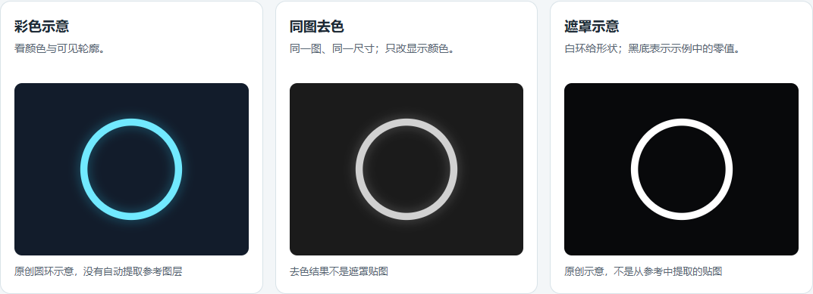

# UE5 特效：每次理解一层

你给参考图、视频或 UE 资产，AI 每次只拆一层：**贴图 → 材质 → 粒子 → 作用**。先看懂，再自己改，不默认做完整特效。

## 直接这样问

> 使用 $ue5-vfx-step-by-step。帮我理解这个特效中的一层。先用简单表格讲清贴图、材质、粒子和作用，再给彩色/去色参考、两个修改建议，以及这层能用在哪些完整特效中。看不出来的地方请标“推测”。

只想改变表达方式时：

> 使用 $plain-chinese-explanations。用简单中文解释，先说看得见的变化，少用术语。

## 每轮会得到什么

| 内容 | 你能看懂什么 |
| --- | --- |
| 一层的说明表 | 贴图、材质、粒子各自负责什么 |
| 可选图卡 | 彩色看颜色，去色看形状和明暗 |
| 修改建议 | 改哪一项，会怎样变化 |
| 用途方向 | 这层可用于命中、蓄力、护盾等效果的哪个部分 |
| 一个小步骤 | 只验证这层的一项变化 |

没有工程资产时，隐藏的贴图、节点和参数只能是推测。去色图是画面的黑白预览，**不是原始遮罩贴图**。一层视觉效果也不一定对应一个发射器。

## 先看一个例子

- [一层扩散光环：短表格与用途](examples/one-layer-ring.md)
- [彩色、去色、遮罩、时间变化图卡](.agents/skills/ue5-vfx-step-by-step/assets/layer-card.html)：下载 HTML 后在浏览器打开，或在 Codex 预览。
- [先前的蓝色命中练习](examples/first-effect.md)：现在同样以一层为起点。

图卡默认是原创结构示意，不是游戏截图，也不是已经制作好的 UE 资产。可以选择本地参考图、真实单层截图和真实贴图；选择的图片仅在本地显示。

## 仓库中的两个 skill

| 入口 | 用途 |
| --- | --- |
| [ue5-vfx-step-by-step](.agents/skills/ue5-vfx-step-by-step/SKILL.md) | 单层分析、图卡、修改、用途推荐；需要时再指导制作 |
| [plain-chinese-explanations](.agents/skills/plain-chinese-explanations/SKILL.md) | 简单中文、短表格、术语解释和明确操作 |

制作时只读取当前需要的贴图、材质或 Niagara 参考。原始来源、检索结果和取舍见 [SOURCES.md](SOURCES.md)。

## 图卡工具与实际能力

图卡生成脚本只需要 Python 3，使用方法见 [图卡参考](.agents/skills/ue5-vfx-step-by-step/references/visual-cards.md)。它把你已有的图片放进本地 HTML，使用浏览器去色预览；不改原图、不上传，也不会自动分离出游戏中的真实图层。

本仓库提供工作方法和示意图，没有 UE 编辑器连接或可运行的 `.uasset`。实际节点、参数和画面需要按你的 UE 版本验证。原始 Niagara skill 标注目标 UE 5.8，不能当作所有版本已测试。

整理日期：2026-10-01。保留之前采用来源的 Apache-2.0 LICENSE 与 NOTICE。
