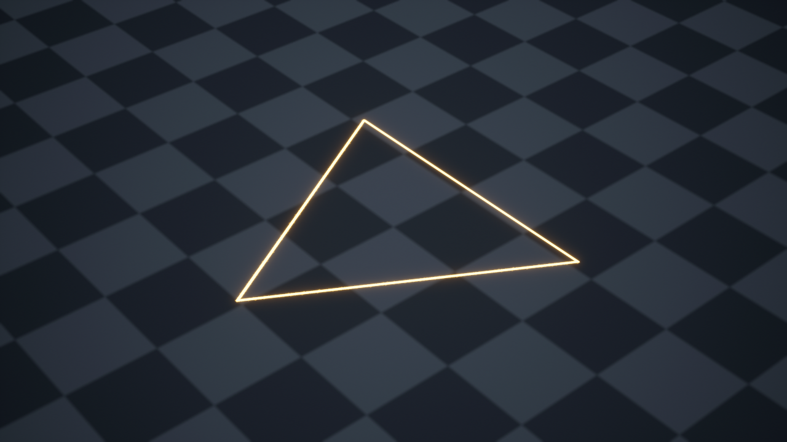

# 第一轮：金色细三角

这一轮只做好一圈细金线。它是平面粒子，三角中间能透出背景。

这是依据参考前五秒所做的单层试做，颜色、线宽和节奏是本轮参数，不是原作者资产。暂不添加符文、月牙、蓝框和角光。淡出是试做设计，参考前五秒没有展示完整消散过程。



[播放 UE 实际短片](Preview/triangle-ue55.mp4)。短片为 1280×720、30 帧/秒、3.2 秒：包含效果结束后的空画面。

| 内容 | 当前做法 | 负责什么 |
| --- | --- | --- |
| 贴图 | 1024×1024 黑白 PNG，白线宽 6 像素 | 给出空心三角轮廓；使用 R 通道 |
| 材质 | 金色、发光 8、显现强度 1 | 给白线加颜色；黑色处透出背景 |
| 运动 | 300×300 厘米平面，水平、静止 | 先看清本层形状；不需要独立模型 |
| 发射 | 一次生成一个粒子，寿命 2 秒 | 播放一次，不连续生成 |
| 消散 | 0.2 秒显现 → 1.5 秒停留 → 0.3 秒淡出 | 亮度逐渐归零，粒子随后结束 |

## 在 UE5.5 使用

1. 下载仓库，在 **UE5.5** 打开 `Project/TriangleTrial.uproject`。启动地图是 `L_TriangleTrial`。
2. 打开 `Content/TriangleLine/LS_TriangleTrial`，从头播放，就能看出现和淡出。材质预览球没有粒子年龄，不用它判断淡入淡出是否正常。
3. 用到自己的工程：右键 `NS_TriangleLine` → **资产操作 / Asset Actions → 迁移 / Migrate**，选择自己工程的 `Content` 文件夹。迁移时带上材质和贴图依赖。把这个 Niagara 系统拖进关卡，播放时触发一次即可。

## 可以先改哪里

打开 `MI_TriangleGold`，勾选要修改的参数。

| 想改什么 | 改哪项 | 会看到什么 |
| --- | --- | --- |
| 颜色 | `GoldColor` | 金色变成你选的颜色 |
| 发光 | `GlowStrength`，当前 8 | 越大越亮，过亮会接近白色 |
| 显现程度 | `Visibility`，当前 1 | 调到 0 隐藏；这是加法材质，降低它会减弱亮线 |

本轮先确认**三角形状、亮度、显现节奏**。需要修改时只改这一层。

确认以后，这层可以作为地面法阵的轮廓、技能蓄力的标记，或三角形护盾的边线。这些只是用途方向，其他层尚未制作。

## 文件与验证

| 文件 | 内容 |
| --- | --- |
| `SourceAssets/T_TriangleLine.png` / `.svg` | 真正的黑白遮罩和可编辑形状源；PNG 自身 Alpha 为全不透明，隐藏黑底由材质实现 |
| `Project/Content/TriangleLine/T_TriangleLine.uasset` | UE 贴图，关闭 sRGB，Masks 压缩 |
| `M_TriangleGold.uasset` / `MI_TriangleGold.uasset` | 原生材质和可调整实例 |
| `NS_TriangleLine.uasset` | 原生 Niagara 系统，包含一个 Sprite 发射器 |
| `L_TriangleTrial.umap` / `LS_TriangleTrial.uasset` / `M_TrialFloor.uasset` | 棋盘背景、相机和预览序列，用来核对留白 |
| `build_ue55.py` / `verify_ue55.py` / `render_preview.py` | 原生创建、重新加载验证、UE 渲染脚本 |
| `build-report.json` / `verification.json` / `Preview/render-report.json` | 资产路径、实际粒子数据与录制结果 |

实测环境：**UE5.5.4，build 40574608**。材质和 Niagara 编译保存后，在新编辑器进程重新加载。CPU 模拟在 0.033–1.9 秒取样均为一个粒子，寿命读回 2 秒、尺寸读回 300×300 厘米；约 2.033 秒取样为零，2.167 秒组件结束。时刻有一帧及浮点误差，不能把显示为 2.000 秒的浮点数当成精确边界。

短片由 **UE Movie Render Queue** 输出真实帧，再编码为 MP4。画面中三角内部的棋盘可见，结束后棋盘继续显示，没有亮线残留。运行结果不代表已精确复原原作者的隐藏材质节点。

制作和渲染使用引擎自带编辑器插件；不需要第三方 MCP 或 C++ 工具链。`build_ue55.py` 只用于**没有同名资产的新试做工程**，不会覆盖已有资产。正常使用直接打开附带资产即可。

重新生成时，在启用本工程插件的新工程中用完整编辑器执行脚本：

```powershell
& '你的UE5.5目录/Engine/Binaries/Win64/UnrealEditor-Cmd.exe' '新试做工程.uproject' '-ExecutePythonScript=这个示例目录/build_ue55.py' -unattended -NoSound
```

验证、渲染同样使用完整编辑器启动，只将脚本替换为 `verify_ue55.py` 或 `render_preview.py`。不加 `-NullRHI` 或 `-run=pythonscript`。渲染 PNG 中间帧默认写入 `Preview/frames`，仓库只发布最终 PNG 和 MP4。

这一轮使用 [单层制作 skill](../../.agents/skills/ue55-vfx-layer-production/SKILL.md)。用户参考视频与其截帧保留在本地，不包含在示例工程或上传内容中。
